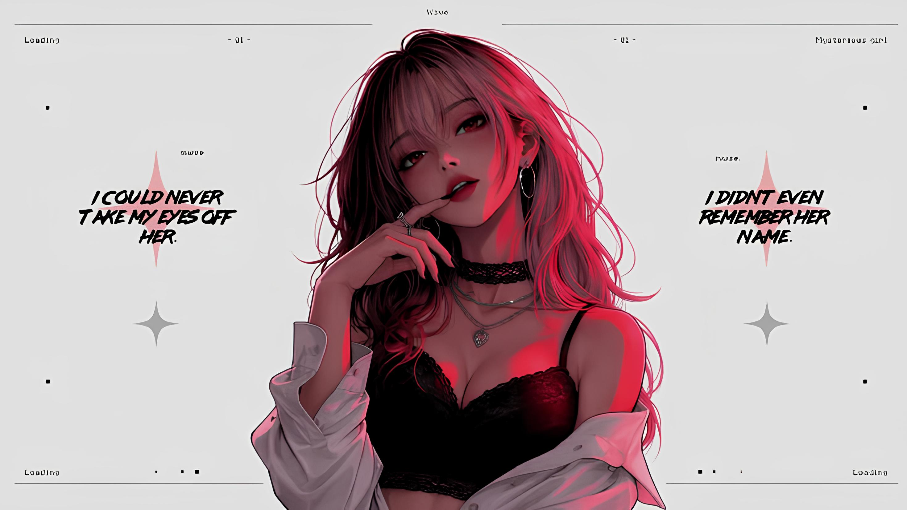
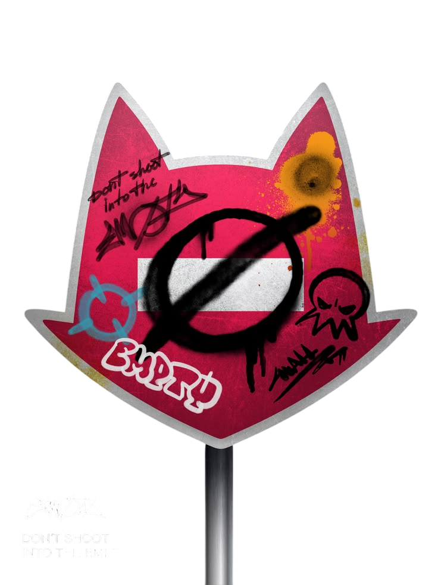

 

# AZIZDEV404

### Full Stack Developer

*"Building software that matters. Chasing mastery every single day."*

---

<table>

<tr>

<td width="65%">

## About

Building software isn't just something I do—it's the challenge that keeps me moving.

I enjoy creating products from nothing, solving difficult problems, and constantly pushing beyond yesterday's limits.

Every project teaches something new.

Every obstacle builds discipline.

Every bug is another lesson.

My dream is ambitious:

**To become the King of Developers.**

Not by title.

Not by ego.

But through mastery, impact, consistency, and building software people genuinely enjoy using.

</td>

<td align="center">

</td>

</tr>

</table>

---

# Development Arsenal

---

# GitHub Overview

  

---

# Featured Projects

<table>

<tr>

<td width="50%">

### 🚀 Project One

Short description.

</td>

<td width="50%">

### 🚀 Project Two

Short description.

</td>

</tr>

<tr>

<td width="50%">

### 🚀 Project Three

Short description.

</td>

<td width="50%">

### 🚀 Open Source

Coming Soon...

</td>

</tr>

</table>

---

  

> **"A king isn't made in a day. Every commit is another step forward."**

