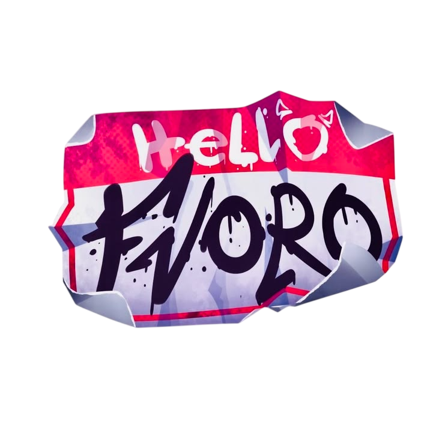

 

# Az1z_404

### Full Stack Developer

> *Building software that matters. Chasing mastery every single day.*

---

<table>
<tr>

<td width="65%" valign="top">

# About Me

I'm a Full Stack Developer passionate about building modern, scalable and high-performance applications.

I enjoy solving problems, learning new technologies and transforming ambitious ideas into real products.

Every project makes me better.
Every bug teaches me something.
Every challenge builds discipline.

### Focus

- Modern Web Development
- Backend Architecture
- Clean Code
- Performance Optimization
- UI / UX
- Continuous Learning

> **Ultimate Goal:** Become one of the world's best software engineers through mastery, consistency and impact.

</td>

<td width="35%" align="center">

</td>

</tr>
</table>

---

# Development Arsenal

---

## 📊 GitHub Analytics

 

 

